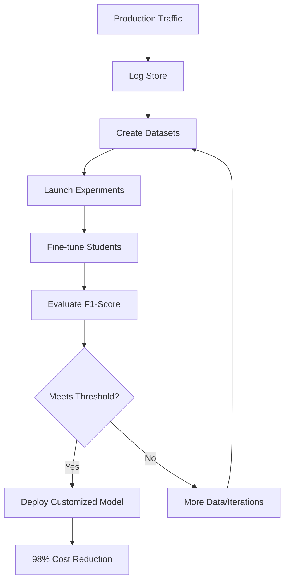

# AI Model Distillation for Financial Data Blueprint Skill

Model distillation for creating cost-efficient LLMs for financial workloads using NVIDIA Data Flywheel Blueprint.

## Description

This skill provides tools for distilling large language models into smaller, cost-efficient models for financial workloads. Demonstrates achieving teacher-model accuracy while reducing inference costs by up to 98% using NVIDIA NeMo Microservices.

## When to Use

- LLM cost optimization
- Model distillation and compression
- Financial text classification
- Domain-specific model fine-tuning
- Performance evaluation and benchmarking
- Production ML pipeline deployment

## Blueprint Source

Based on: [NVIDIA ai-model-distillation-for-financial-data](https://github.com/NVIDIA-AI-Blueprints/ai-model-distillation-for-financial-data)

## Tools

### Data Flywheel Tools

| Tool | Description |
|------|-------------|
| `create_flywheel_run` | Create new flywheel experiment run |
| `get_run_status` | Get flywheel run status |
| `get_run_results` | Get experiment results |
| `list_flywheel_runs` | List all flywheel runs |
| `cancel_run` | Cancel running experiment |

### Dataset Tools

| Tool | Description |
|------|-------------|
| `create_dataset` | Create training/eval dataset |
| `upload_logs` | Upload LLM logs for distillation |
| `curate_dataset` | Curate and prepare dataset |
| `split_dataset` | Stratified train/eval split |
| `get_dataset_stats` | Get dataset statistics |

### Fine-tuning Tools

| Tool | Description |
|------|-------------|
| `launch_finetuning` | Launch LoRA fine-tuning job |
| `get_finetuning_status` | Get fine-tuning job status |
| `list_customized_models` | List customized models |
| `deploy_customized_model` | Deploy fine-tuned model as NIM |

### Evaluation Tools

| Tool | Description |
|------|-------------|
| `run_evaluation` | Run F1-score evaluation |
| `compare_models` | Compare model performance |
| `get_evaluation_report` | Get detailed evaluation report |
| `benchmark_inference` | Benchmark inference latency |

### Financial Classification Tools

| Tool | Description |
|------|-------------|
| `classify_financial_news` | Classify financial news headlines |
| `batch_classify` | Batch classification |
| `get_classification_labels` | Get available event categories |

## Architecture

```
┌─────────────────────────────────────────────────────────────────┐
│                    Application Layer                              │
│  ┌───────────────────────────────────────────────────────────┐  │
│  │ Financial News Application                                 │  │
│  │ - News ingestion                                          │  │
│  │ - LLM inference (Teacher Model)                           │  │
│  │ - Feedback collection                                      │  │
│  └───────────────────────────────────────────────────────────┘  │
└───────────────────────────────────────────────────────────────────┘
        │ Prompts/Responses/Feedback
        ↓
┌───────────────────────────────────────────────────────────────────┐
│                    Data Flywheel                                  │
│  ┌───────────────────────────────────────────────────────────┐   │
│  │ Log Store (Elasticsearch)                                 │   │
│  │ - De-duplication by task                                  │   │
│  │ - Stratified splitting                                    │   │
│  └───────────────────────────────────────────────────────────┘   │
│  ┌───────────────────────────────────────────────────────────┐   │
│  │ Orchestrator (FastAPI + Celery)                           │   │
│  │ - Experiment management                                    │   │
│  │ - Parallel evaluation                                      │   │
│  └───────────────────────────────────────────────────────────┘   │
└───────────────────────────────────────────────────────────────────┘
        │
        ↓
┌───────────────────────────────────────────────────────────────────┐
│                    NeMo Microservices                             │
│  ┌───────────────────┐  ┌───────────────────────────────────┐     │
│  │ NeMo Datastore    │  │ NeMo Customizer                   │     │
│  │ - Dataset storage │  │ - LoRA fine-tuning                │     │
│  └───────────────────┘  └───────────────────────────────────┘     │
│  ┌───────────────────┐  ┌───────────────────────────────────┐     │
│  │ NeMo Evaluator    │  │ NIM Inference                     │     │
│  │ - F1-score eval   │  │ - Model serving                   │     │
│  └───────────────────┘  └───────────────────────────────────┘     │
└───────────────────────────────────────────────────────────────────┘
        │
        ↓
┌───────────────────────────────────────────────────────────────────┐
│                    Models                                         │
│  ┌───────────────────────────────────────────────────────────┐   │
│  │ Teacher: Llama 3.3 Nemotron 49B / Llama 3.3 70B          │   │
│  │ Students: Llama 3.2 1B/3B, Llama 3.1 8B                  │   │
│  └───────────────────────────────────────────────────────────┘   │
└───────────────────────────────────────────────────────────────────┘
```

## Configuration

### Environment Variables

```bash
# NVIDIA NeMo Microservices
NEMO_API_URL=http://localhost:8080
NEMO_DATASTORE_URL=http://localhost:8081
NEMO_CUSTOMIZER_URL=http://localhost:8082
NEMO_EVALUATOR_URL=http://localhost:8083

# Infrastructure
ELASTICSEARCH_URL=http://localhost:9200
MONGODB_URL=mongodb://localhost:27017
REDIS_URL=redis://localhost:6379

# Models
TEACHER_MODEL=llama-3.3-nemotron-super-49b-v1
STUDENT_MODELS=llama-3.2-1b,llama-3.2-3b,llama-3.1-8b
```

### Integration with DeerFlow

```python
from deerflow.blueprints import FinancialDistillationBlueprint

flywheel = FinancialDistillationBlueprint(
    teacher_model="llama-3.3-nemotron-super-49b-v1",
    student_models=["llama-3.2-1b", "llama-3.2-3b"],
    eval_metric="f1_score"
)

# Create dataset from production logs
dataset = await flywheel.create_dataset(
    log_source="elasticsearch",
    task="financial_news_classification",
    num_samples=25000
)

# Run flywheel experiment
run = await flywheel.create_flywheel_run(
    dataset_id=dataset.id,
    student_model="llama-3.2-1b",
    finetuning_method="lora"
)

# Get results
results = await flywheel.get_run_results(run.id)
print(f"Base F1: {results.base_f1}")
print(f"Customized F1: {results.customized_f1}")
print(f"Cost reduction: {results.cost_reduction}%")
```

## GPU Requirements

### Self-hosted LLM Judge
- 6x NVIDIA H100 or A100 GPUs

### Remote LLM Judge
- 2x NVIDIA H100 or A100 GPUs

### Minimum System
- 200+ GB free disk space
- Python 3.11+
- Docker Engine
- Docker Compose v2

## Performance Results

### Financial News Classification (13 categories)

| Dataset Size | Model | Base F1 | Customized F1 | Improvement |
|--------------|-------|---------|---------------|-------------|
| 5K samples | Llama 3.2 1B | 0.36 | 0.85 | +136% |
| 10K samples | Llama 3.2 1B | 0.34 | 0.89 | +162% |
| 25K samples | Llama 3.2 1B | 0.32 | 0.95 | +197% |
| 25K samples | Llama 3.2 3B | 0.72 | 0.95 | +32% |

### Cost Savings
- **~98% inference cost reduction** (70B → fine-tuned 1B)
- Similar performance at fraction of the cost

## Example Usage

```python
from deerflow.tools.distillation import (
    DataFlywheel,
    ModelDistiller,
    FinancialClassifier
)

# Initialize flywheel
flywheel = DataFlywheel(
    teacher="llama-3.3-nemotron-49b",
    students=["llama-3.2-1b"]
)

# Generate labeled data with teacher
classifier = FinancialClassifier(model="llama-3.3-nemotron-49b")
labeled_data = await classifier.label_dataset(
    headlines=unlabeled_headlines,
    categories=FINANCIAL_EVENTS
)

# Run distillation
distiller = ModelDistiller()
result = await distiller.distill(
    teacher="llama-3.3-nemotron-49b",
    student="llama-3.2-1b",
    training_data=labeled_data,
    method="lora"
)

# Evaluate
eval_result = await distiller.evaluate(
    model=result.customized_model,
    test_data=test_data,
    metric="f1_score"
)

print(f"F1 Score: {eval_result.f1}")
print(f"Cost reduction: {result.cost_reduction}%")
```

## Financial Event Categories

1. Market Movement
2. Earnings Announcement
3. Regulatory Change
4. M&A Activity
5. Product Launch
6. Executive Change
7. Legal Action
8. Dividend Declaration
9. Stock Split
10. Analyst Rating
11. Guidance Update
12. Partnership
13. Other Material Event

## Data Flywheel Process



## References

- [NVIDIA Data Flywheel Blueprint](https://developer.nvidia.com/blog/build-efficient-ai-agents-through-model-distillation-with-nvidias-data-flywheel-blueprint/)
- [NeMo Microservices Documentation](https://docs.nvidia.com/nemo/microservices/latest/)
- [Model Distillation Blog](https://developer.nvidia.com/blog/build-efficient-financial-data-workflows-with-ai-model-distillation)
